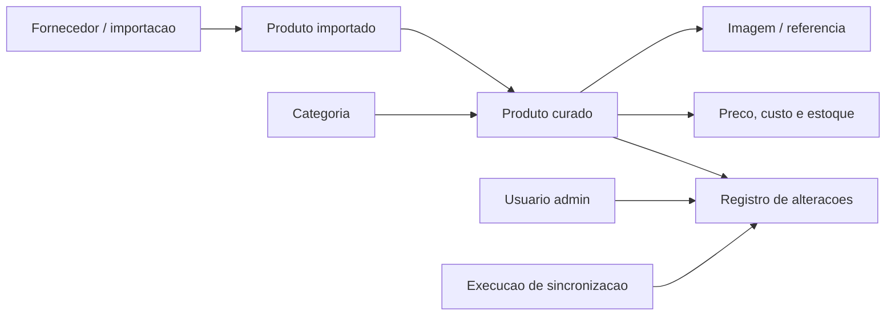

# Estrutura de dados do catalogo

Esta base ainda nao escolhe banco, ORM, API ou provedor de autenticacao. O
objetivo e deixar o dominio pronto para receber o banco atual do usuario quando
ele estiver disponivel.

## Visao geral

## Modelos criados

| Modelo | Uso |
| --- | --- |
| `SupplierProduct` | Registro bruto/importado do fornecedor, com ID externo, dados crus, custo, preco sugerido, estoque e status de importacao. |
| `CatalogProduct` | Produto curado para venda/publicacao, com SKU interno, titulo, categoria, preco, custo, estoque, tags, imagens e status. |
| `Category` | Taxonomia do catalogo, com suporte a hierarquia futura por `parentId`. |
| `ProductImageReference` | Referencias de imagens locais, curadas ou vindas de fornecedor. |
| `SyncRun` | Historico de sincronizacoes/importacoes. |
| `AdminUser` | Usuario administrativo com papel: proprietario, gestor ou vendedor. |
| `AuditLogEntry` | Registro basico de alteracoes por usuario, entidade e acao. |

## Permissoes iniciais

| Papel | Permissoes previstas |
| --- | --- |
| Proprietario (`owner`) | Ver, editar, publicar, importar fornecedor, gerenciar usuarios e ver auditoria. |
| Gestor (`manager`) | Ver, editar, publicar, importar fornecedor e ver auditoria. |
| Vendedor (`seller`) | Ver catalogo. |

No login local, esses papeis sao gravados em `scx_catalog_admin_users.role` e
avaliados no servidor antes de abrir o painel administrativo.

## Camada de acesso

`src/domain/catalog/repository.ts` define uma porta `CatalogAccess`.
`src/domain/catalog/postgresAccess.ts` implementa essa porta para PostgreSQL
quando `DATABASE_URL` esta definida. Sem `DATABASE_URL`, o painel continua usando
dados demonstrativos em memoria.

As tabelas SQL ficam em `db/migrations/001_catalog_schema.sql` e usam o prefixo
`scx_catalog_` para nao sobrescrever tabelas restauradas do n8n ou de outro
sistema.

## Mapeamento necessario quando houver banco

| Dado atual do banco/planilha/API | Destino no dominio |
| --- | --- |
| Codigo do fornecedor | `SupplierProduct.externalId` |
| Nome bruto do fornecedor | `SupplierProduct.rawName` |
| Categoria do fornecedor | `SupplierProduct.rawCategory` e depois `Category` |
| Nome final publicado | `CatalogProduct.title` |
| SKU interno | `CatalogProduct.sku` |
| Preco de venda | `CatalogProduct.price.amountInCents` |
| Custo | `CatalogProduct.cost.amountInCents` |
| Estoque | `CatalogProduct.stock.quantity` |
| Fotos/URLs | `ProductImageReference.url` |
| Publicado/oculto | `CatalogProduct.publicationStatus` |
| Historico de atualizacoes | `AuditLogEntry` |

## Fonte Asia Import

O fornecedor Asia Import e mapeado como `supplier_id='asia-import'`.
Cada item retornado por `listarProdutos2` e salvo primeiro em
`SupplierProduct`/`scx_catalog_supplier_products`, preservando `raw_payload` para
auditoria e remapeamento futuro. A criacao de produto curado e manual e gera um
`CatalogProduct` em rascunho, nunca publicado automaticamente.

## Proximo dado que precisamos do usuario

Para conectar a proxima fase sem retrabalho, o dado mais importante e uma amostra
real do catalogo atual: nomes de colunas/tabelas, 5 a 10 produtos reais,
categorias, preco, custo, estoque, imagens e como o fornecedor identifica cada
produto.
