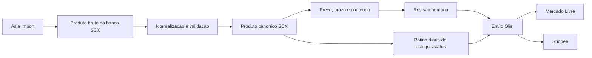

# Sistema SCX - prioridades de implementacao

Este documento define a ordem de implementacao do Sistema SCX a partir do estado
real do projeto local. A prioridade comercial e vender em marketplace o quanto
antes, usando o Olist como primeiro distribuidor para Mercado Livre e Shopee,
sem transformar o Olist na fonte da verdade.

## Decisao principal

A SCX precisa ter uma base propria, normalizada e auditavel. O Olist deve ser o
primeiro conector urgente, porque destrava Mercado Livre e Shopee, mas o produto
oficial deve nascer e ser corrigido no banco da SCX.

Nao vamos reconstruir o projeto atual, trocar tecnologia ou esperar o sistema
perfeito. Vamos completar o que ja existe e publicar em lotes controlados.

## Estado atual

Ja existe no projeto:

- Catalogo central em PostgreSQL com produtos importados e produtos curados.
- SKU interno unico da SCX.
- Importacao manual da Asia Import.
- Preservacao do payload bruto do fornecedor.
- Criacao de rascunhos revisaveis no painel administrativo.
- Painel de edicao, status, preco, estoque, imagens e publicacao.
- Motor de preco com multiplicador padrao 2,2, taxas, perdas, minimo,
  arredondamento e faixas por quantidade.
- Auditoria basica, usuarios administrativos, migracoes e Docker.

Ainda falta para vender em marketplace:

- Produto canonico com todos os campos exigidos por multiplos canais.
- Persistencia clara de preco final, custo consolidado, prazo de producao e
  motivo das regras aplicadas.
- Normalizacao completa de medidas, peso, NCM, imagens e embalagem individual.
- Prazo por fornecedor: 3 dias uteis para Asia Import e 7 dias uteis para XBZ.
- Conector Olist idempotente, com mapeamento de SKU para ID externo.
- Rotina diaria de estoque/status: atualizar saldo, habilitar e desabilitar
  produtos no Olist conforme regras da SCX, sem alterar cadastro manualmente.
- Fila de envio, logs de erro e reprocessamento.
- Validacao real da publicacao no Mercado Livre e Shopee via Olist.
- Normalizador XBZ.
- IA para titulo e descricao com revisao humana.

## Ranking P0 - vender ontem

1. Validar ambiente local, banco, backup e credenciais.

   Antes de mexer em massa, confirmar que o banco local esta acessivel, que as
   migracoes rodam, que existe backup e que as credenciais da Asia Import e do
   Olist estao fora do codigo.

2. Completar o produto canonico multicanal.

   Adicionar ao modelo central os campos que marketplaces costumam exigir:
   NCM, peso, altura, largura, comprimento, tipo de embalagem, imagem principal,
   galeria, marca, origem, categoria comercial, condicao, prazo de producao,
   status de revisao e status de elegibilidade para canal.

3. Completar a normalizacao da Asia Import.

   Consolidar custo, estoque, imagens, NCM, peso e medidas. Separar embalagem
   individual de caixa-mae quando houver informacao. Se o dado necessario nao
   existir, bloquear envio e registrar o motivo.

4. Persistir regras comerciais essenciais.

   Gravar preco final calculado, custo consolidado, multiplicador aplicado,
   prazo de producao e alertas de validacao. Para Asia Import, usar 3 dias uteis
   como regra configuravel.

5. Implementar conteudo minimo revisavel.

   Gerar ou editar titulo, descricao curta, descricao completa, caracteristicas
   e palavras-chave. A IA pode ajudar nesse ponto, mas nao pode inventar medida,
   peso, material, estoque, preco ou dado fiscal.

6. Criar conector Olist idempotente.

   Enviar produto simples como rascunho/inativo quando possivel, atualizar se o
   SKU ja existir, salvar ID do Olist, payload enviado, resposta recebida, erros
   e data da ultima sincronizacao.

7. Implementar sincronizacao diaria minima de estoque e status.

   O sistema deve recalcular elegibilidade diariamente e enviar ao Olist pelo
   menos estoque e situacao. Produto sem estoque, bloqueado por regra, sem
   imagem, sem preco valido, sem dado fiscal/logistico obrigatorio ou fora da
   politica comercial deve ser desabilitado/inativado. Produto corrigido e
   elegivel pode ser habilitado conforme regra aprovada. O painel do site deve
   permitir selecionar/enfileirar produtos para envio e acompanhar o resultado.

8. Enviar piloto de 10 produtos simples.

   Escolher produtos com dados completos, boas imagens e baixa chance de erro.
   Corrigir problemas no normalizador e nas regras, nao manualmente em cada SKU.

9. Validar Mercado Livre e Shopee via Olist.

   O marco so conta como concluido quando pelo menos um produto for aceito no
   Olist e confirmado nos canais conectados que importam dele.

10. Enviar lote de 50 produtos.

   Repetir com controle de erros, logs e reprocessamento. So aumentar volume
   depois de entender recusas, campos obrigatorios e divergencias por canal.

11. Processar restante dos produtos simples elegiveis.

    Produtos incompletos ficam em fila de correcao. Produto com bloqueio nao
    deve ser enviado no improviso.

## Ranking P1 - estabilizar operacao

1. Criar fila de sincronizacao e painel de erros.
2. Permitir reprocessar produto depois de correcao.
3. Registrar historico de alteracoes em preco, prazo, conteudo e canal.
4. Criar validadores por canal: Olist, Mercado Livre, Shopee e site.
5. Criar agendamento diario de estoque/status com relatorio de alteracoes.
6. Melhorar revisao humana: comparar original, normalizado e versao final.
7. Criar relatorio de produtos bloqueados por motivo.

## Ranking P2 - ampliar fornecedores e complexidade

1. Implementar normalizador XBZ.
2. Aplicar prazo configuravel de 7 dias uteis para XBZ.
3. Criar interface comum para fornecedores.
4. Tratar variacoes reais: cor, tamanho, capacidade e SKU filho.
5. Tratar kits pelo componente mais lento e pelo custo consolidado.
6. Criar calendario de dias uteis e feriados.

## Ranking P3 - automacao e inteligencia

1. Aprovar automaticamente apenas produtos que passem em todas as validacoes.
2. Sincronizar estoque e preco em rotina segura.
3. Melhorar IA de conteudo com versao de prompt, alertas e auditoria.
4. Criar paineis de margem, giro, atrasos e produtos recusados.
5. Gerar recomendacoes de reposicao e compra.

## Ranking P4 - sistema completo

1. Pedidos, producao, compras, reposicao e expedicao integrados.
2. Painel operacional por etapa.
3. Analise de desempenho por canal, fornecedor e categoria.
4. Automacoes comerciais para novos canais.

## Criterios de corte

Nao entra no caminho critico agora:

- Reescrever o projeto.
- Trocar banco, framework ou arquitetura sem necessidade.
- Fazer painel definitivo antes do piloto.
- Implementar XBZ antes de publicar os primeiros produtos da Asia.
- Implementar kits e variacoes antes de produto simples funcionar.
- Enviar catalogo inteiro sem piloto.

## Fluxo minimo de marketplace

O detalhamento operacional para Olist/Tiny, incluindo SKU SCX, codigo do
fornecedor, elegibilidade, categoria, etapas, estrutura e envio em massa, esta em
[`docs/olist-marketplace-flow.md`](./olist-marketplace-flow.md).

## Regras de IA

A IA entra depois da normalizacao. Ela pode melhorar titulo, descricao,
caracteristicas, meta descricao e palavras-chave. Ela nao decide preco, estoque,
prazo, peso, medida, NCM, compatibilidade ou dado fiscal.

Toda geracao de IA deve guardar:

- Dados enviados.
- Texto gerado.
- Versao do prompt.
- Alertas de dados ausentes.
- Usuario que aprovou ou rejeitou.

## Definicao de pronto para a fase urgente

A fase urgente esta pronta quando:

- O banco SCX tem produto canonico suficiente para marketplaces.
- Produto simples da Asia Import calcula preco e prazo automaticamente.
- Produto incompleto e bloqueado com motivo visivel.
- Olist recebe criacao e atualizacao por SKU sem duplicar produto.
- Estoque e situacao no Olist podem ser atualizados diariamente por regra.
- ID e resposta do Olist ficam salvos.
- Um piloto passa pelo Olist e aparece corretamente no Mercado Livre e na Shopee.
